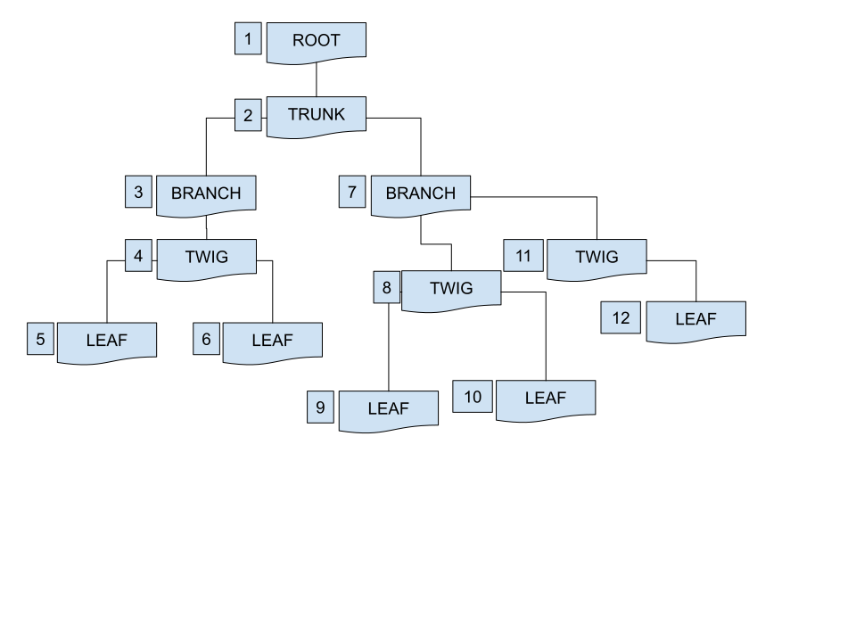
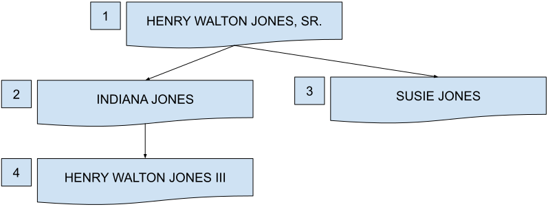
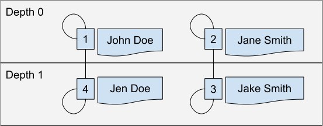

# Closurable

[](https://packagist.org/packages/codrasil/closurable)
[](https://packagist.org/packages/codrasil/closurable)
[](https://packagist.org/packages/codrasil/closurable)
[](https://packagist.org/packages/codrasil/closurable)

---

<p align="center"></center></p>
Closure Table relational database implementation in PHP for any hierarchical data.

### Requirements

* `PHP`: `^7.x`
* `MySQL`: any version should be fine.

---

### Installation

This package is originally built for <a href="https://github.com/laravel/laravel">Laravel</a>, but can also be used in any PHP project.

<a href="docs/integration.md">Read more about integration in the docs.</a>

**via composer:**
```bash
composer require codrasil/closurable
```


### Publishing Configuration
Pass in the artisan command the package's service provider:

```bash
php artisan vendor:publish --provider="Codrasil\Closurable\NestableServiceProvider"
```

---

### Setup

#### Generating Migration File
First, run the console command to generate a nested migration table.

Format:
```bash
make:closurable [options] [--] <reference>
```

Example:

_We will be using the `users` model to generate a nested relationship of users._
```bash
php artisan make:closurable users
```

The command accepts an argument of `referenced table`. This will be the table to be "closured".

It will generate a table named `userstree` that comes pre-populated with the necessary columns.

The generated file should look something like below:
```php
Schema::create('userstree', function (Blueprint $table) {
    $table->unsignedBigInteger('ancestor_id')->index();
    $table->unsignedBigInteger('descendant_id')->index();
    $table->unsignedBigInteger('depth')->index()->default(0);
    $table->unsignedBigInteger('root')->index()->default(0);
    $table->unique(['ancestor_id', 'descendant_id']);
    $table->index(['ancestor_id', 'descendant_id', 'depth']);
    $table->index(['descendant_id', 'depth']);
    $table->index(['depth', 'root']);
    $table->foreign('ancestor_id')
          ->references('id')
          ->on('users')
          ->onDelete('cascade')
          ->onUpdate('cascade');
    $table->foreign('descendant_id')
          ->references('id')
          ->on('users')
          ->onDelete('cascade')
          ->onUpdate('cascade');
});
```

**Note** that you should generate the migration file of the **referenced table** yourself before running the command (in the above example, you should generate the migration for the `users` table yourself).

**Note** to change the table name of the closure table, pass in an option `--table` or `--create`:
```bash
php artisan make:closurable users --table=familytree
```

Run `php artisan make:closurable --help` for more information on configuring the command.

#### Model usage
Next, use either of the two options on the model to be closure nested.

_Following our example above, the `User` model should either implement:_

* the trait, `Closurable`:

  ```
  use Codrasil\Closurable\Closurable;

  class User extends Authenticatable
  {
      use Closurable;
  }
  ```

  or

* via extending the abstract class, `Codrasil\Closurable\Model`, instead of the default Illuminate Model class:

  ```
  use Codrasil\Closurable\Model;

  class User extends Model
  {
     // Of course, you will need to reimplement the Authenticatable traits
     // to the User model if you ARE going to nest the User model.
  }
  ```


---

### Usage

#### Saving a Branch Node

Let's say we have the following data on our `users` table:

| ID |   Name                  |
| -- | ----------------------- |
| 1  | Henry Walton Jones, Sr. |
| 2  | Indiana Jones           |
| 3  | Susie Jones             |
| 4  | Henry Walton Jones III  |

And we need the following relationship:

<p align="center"></center></p>

To save the relationships described above, we need to use the `closurables()` from the User model to access the `attach(Model $model)` method.

```php
$parent = User::find(1); // Jones, Sr.
$junior = User::find(2); // Indy
$parent->closurables()->attach($junior);

...

$child = User::find(3); // Susie
$parent->closurables()->attach($child);

...
$child = User::find(4); // Jones III
$junior->closurables()->attach($child);
```

The relationship will be saved in the `familytree` table as:

| ancestor_id | descendant_id | depth | root |
| ----------: | ------------: | ----: | ---: |
|           1 |             1 |     0 |    1 |
|           1 |             2 |     1 |    0 |
|           1 |             3 |     1 |    0 |
|           1 |             4 |     2 |    0 |
|           2 |             2 |     0 |    0 |
|           2 |             4 |     1 |    0 |
|           3 |             3 |     0 |    0 |
|           4 |             4 |     0 |    0 |

Visual representation:



---

##### Displaying Root Nodes

* **Root**

    To display resources without parents, use the `roots` scope:

    ```php
    $roots = MyModel::roots()->get();
    ```

---

#### Querying for Adjacent Relations

By default, sorting is handled via the `sort` column found in the **reference table**.
If the `sort` column is unavailable, it will default to `id` or whatever `$this->getKeyName()` will return.

* **Siblings**

    To retrieve all siblings of a child, use `siblings()` method:

    ```php
    $child = MyModel::find(2);
    $siblings = $child->siblings(); // or $child->siblings
    ```

    * A helper method `->hasSiblings()` for checking emptiness is available.
    * An accessor method `getSiblingsAttribute` is available.

    ---

* **Next Sibling**

    To display the next sibling in the `$user->children`, use `next()` method:

    ```php
    $firstChild = MyModel::find(2);
    $secondChild = $firstChild->next(); // or $firstChild->next
    ```

    * A helper method `->hasNext()` for checking nullness is available.
    * An accessor method `getNextAttribute` is available.

    ---

* **Previous Sibling**

    To display the previous sibling, use `previous()` method:

    ```php
    $secondChild = MyModel::find(3);
    $firstChild = $secondChild->previous(); // or $secondChild->previous
    ```

    * A helper method `->hasPrevious()` for checking nullness is available.
    * An accessor method `getPreviousAttribute` is available.

---

#### Querying for Lineal Relations

* **Parent**

    To retrieve the immediate parent of the child, use `parent()` method:

    ```php
    $child = MyModel::find(2);
    $parent = $child->parent(); // or $child->parent
    ```

    * A helper method `->hasParent()` for checking nullness is available.
    * An accessor method `getParentAttribute` is available.

* **Children**

    To display the children nodes of a specific resource, use the `children()` method:

    ```php
    $user = User::find(1);
    ```

    ```blade
    {{-- in a blade file --}}

    @foreach ($user->children() as $child)
      {{ $child->name }}
    @endforeach

    {{-- use @dd($user->children) to see entire collection --}}
    ```

    * A helper method `->hasChildren()` for checking emptiness is available.
    * An accessor method `getChildrenAttribute` is available.

    ---

* **Ancestors**

    To retrieve all parents of the child (and the parent of the child's parent, and so on), use `ancestors()` method:

    ```php
    $child = MyModel::find(4);
    $ancestors = $child->ancestors();
    // will output the parent([of the parent]*n) + the child.
    // dd($ancestors) to inspect actual data.
    ```

    * A helper method `->hasAncestors()` for checking emptiness is available.
    * An accessor method `getAncestorsAttribute` is available.

    ---

* **Descendants**

    To retrieve all children of the parent (and the children of the parent's children, and so on), use `descendants()` method:

    ```php
    $parent = MyModel::find(2);
    $descendants = $parent->descendants();
    // will output the children([of the children]*n) + the parent.
    // dd($descendants) to inspect actual data.
    ```

    * A helper method `->hasDescendants()` for checking emptiness is available.
    * An accessor method `getDescendantsAttribute` is available.

For more use cases of `adjacent` and `lineal` relations, checkout <a href="./docs/relations.md">Relations</a> section in the docs.

---

### Documentation & Examples

To learn more about the API, visit the <a href="./docs">docs</a> folder.

For more example implementation, checkout <a href="./docs/examples">docs/examples</a> folder. The examples page has a variety of use cases like <a href="./docs/examples/Commenting System.md">Commenting System</a>, <a href="./docs/examples/Taxonomic Ranking.md">Taxonomic Ranking of the Animal Kingdom</a>, <a href="./docs/examples/Family Trees.md">Family Trees</a>, and more.

### License
The library is open-source software licensed under the [MIT license](https://opensource.org/licenses/MIT).
