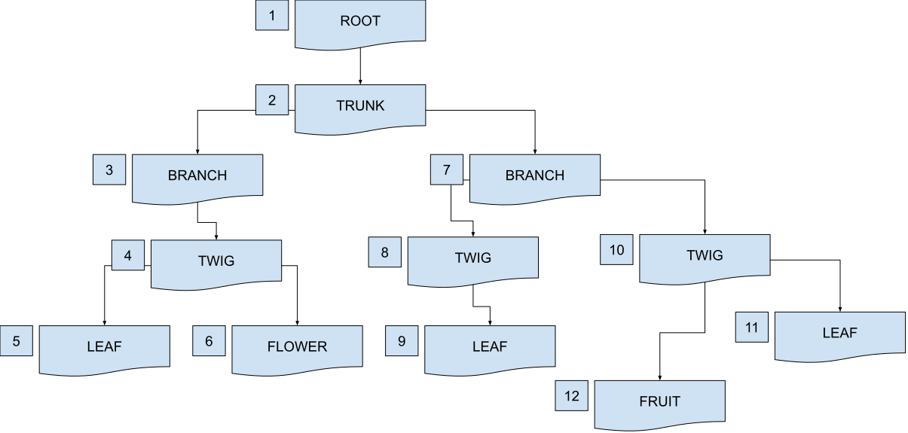
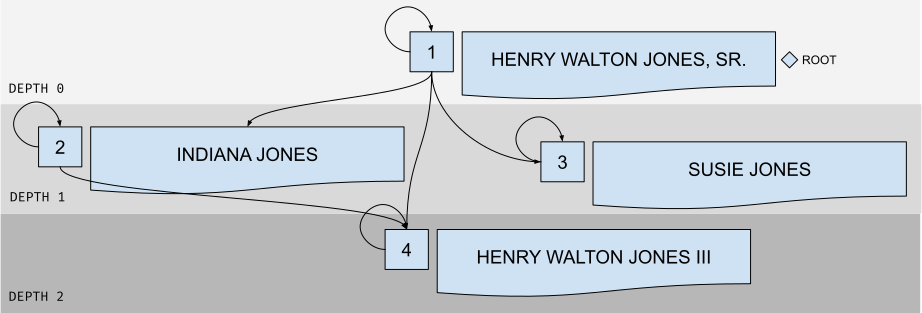

# codrasil/closurable
---

<center></center>

Nested relational database table for any hierarchical resources.

### Installation

This package is originally built for <a href="https://github.com/laravel/laravel">Laravel</a>, but can also be used in any PHP project.

<a href="docs/integration.md">Read more about integration in the docs.</a>

**via composer:**
```
composer require codrasil/closurable
```


### Publishing Configuration Files
Pass in the artisan command the package's service provider:

```
php artisan vendor:publish --provider="Codrasil\Nestable\NestableServiceProvider"
```

---

### Setup

##### Generating migration file
First, run the console command to generate a nested migration table.

_(As an example, we will be using the `users` model to generate a nested relationship of users.)_

```
php artisan make:closurable create_userstree_table users
```

It will generate a table named `userstree` that comes pre-populated with the necessary columns. The second argument is for referencing the main table to be nested (which in the example above, is `users`).

The generated file should look something like below:
```
Schema::create('userstree', function (Blueprint $table) {
    $table->unsignedBigInteger('ancestor_id')->index();
    $table->unsignedBigInteger('descendant_id')->index();
    $table->unsignedBigInteger('depth')->default(0);
    $table->index(['ancestor_id', 'descendant_id']);
    $table->foreign('ancestor_id')
          ->references('id')
          ->on('users')
          ->onDelete('cascade')
          ->onUpdate('cascade');
    $table->foreign('descendant_id')
          ->references('id')
          ->on('users')
          ->onDelete('cascade')
          ->onUpdate('cascade');
});
```

Note that you should generate the migration file of the referenced table yourself before running the above command (in the above example, you should generate the migration for the `users` table yourself).

Run `php artisan make:closurable --help` for more information.

##### Model usage
Next, you need to use either of the two options on your models.

Following our example above, the `User` model should either implement the package via:

* the trait, `Nestable`:

  ```
  use Codrasil\Nestable\Nestable;

  class User extends Authenticatable
  {
      use Nestable;
  }
  ```

  or

* via extending the abstract class, `Model`, instead of the default Illuminate Model class:

  ```
  use Codrasil\Nestable\Model as Nestable;

  class User extends Nestable
  {
     // Of course, you will need to reimplement the Authenticatable traits
     // to the User model if you ARE going to nest the User model.
  }
  ```


---

### Usage

##### Saving a Branch Node

Let's say we have the following data on our `users` table:

| ID |   Name      |
| -- | ----------- |
| 1  | John Doe    |
| 2  | Jane Smith  |
| 3  | Jake Smith  |
| 4  | Jen Doe     |

And we need the following relationship:

| ID |   Name      |       Child         |
| -- | ----------- | ------------------- |
| 1  | John Doe    | Jen Doe             |
| 2  | Jane Smith  | Jake Smith          |

To get the relationships described above, we need to use the `closurables()` method attached to the user.

```php
$parent = User::find(1); // John Doe
$child = User::find(4); // Jen Doe
$parent->closurables()->attach($child);

...

$parent = User::find(2); // Jane Smith
$child = User::find(3); // Jake Smith
$parent->closurables()->attach($child);
```

The relationship will be saved in the `userstree` table as:

| ancestor_id | descendant_id | depth |
| ----------- | ------------- | ----- |
|           1 |             1 |     0 |
|           1 |             4 |     1 |
|           2 |             2 |     0 |
|           2 |             3 |     1 |
|           3 |             3 |     0 |
|           4 |             4 |     0 |

Visual representation:



---

##### Displaying Root Nodes

To display resources without parents, use the `roots` scope:

```php
$roots = MyModel::roots()->get();
```

---

##### Displaying Branch Nodes

To display the children nodes of a specific resource, use the `getChildrenAttribute` accessor:

```php
$user = User::find(1);
```

```blade
{{-- in a blade file --}}

@foreach ($user->children as $child)
  {{ $child->name }}
@endforeach

{{-- use @dd($user->children) to see entire collection --}}
```

---

#### Querying for Adjacent Relations

By default, sorting is handled via the 'sort' column found in the **reference table**.
If the `sort` column is unavailable, it will default to `id` or whatever `$this->getKeyName()` will return.

* Siblings

    To retrieve all siblings of a child, use `siblings()` method:

    ```php
    $child = MyModel::find(4);
    $siblings = $child->siblings(); // or $child->siblings
    ```

    * There is a helper method `->hasSiblings()` for checking nullability.
    * There is a also an accessor `getSiblingsAttribute` helper method.

* Next Sibling

    To display the next sibling in the `$user->children`, use `next()` method:

    ```php
    $firstChild = MyModel::find(4);
    $secondChild = $firstChild->next(); // or $firstChild->next
    ```

    * There is a helper method `->hasNext()` for checking nullability.
    * There is a also an accessor `getNextAttribute` helper method.

* Previous Sibling

    To display the previous sibling, use `previous()` method:

    ```php
    $secondChild = MyModel::find(4);
    $firstChild = $secondChild->previous(); // or $secondChild->previous
    ```

    * There is a helper method `->hasPrevious()` for checking nullability.
    * There is a also an accessor `getPreviousAttribute` helper method.

---

#### Querying for Lineal Relations

* Parent

    To retrieve the immediate parent of the child, use `parent()` method:

    ```php
    $child = MyModel::find(4);
    $parent = $child->parent(); // or $child->parent
    ```

    * There is a also an accessor `getParentAttribute` helper method.

* Children

    To retrieve the immediate children of the parent, use `getChildrenAttribute()` accessor:

    ```php
    $parent = MyModel::find(1);
    $children = $parent->children;
    ```

* Ancestors

    To retrieve all parents of the child (and the parent of the child's parent, and so on), use `getAncestorsAttribute()` accessor:

    ```php
    $child = MyModel::find(4);
    $ancestors = $child->ancestors;
    // will output the parent([of the parent]*n) + the child.
    // dd($ancestors) to inspect actual data.
    ```

* Descendants

    To retrieve all children of the parent (and the children of the parent's children, and so on), use `getDescendantsAttribute()` accessor:

    ```php
    $parent = MyModel::find(1);
    $descendants = $child->descendants;
    // will output the children([of the children]*n) + the parent.
    // dd($descendants) to inspect actual data.
    ```

For more use cases of `adjacent` and `lineal` relations, checkout <a href="./docs/relations.md">Relations</a> section in the docs.
