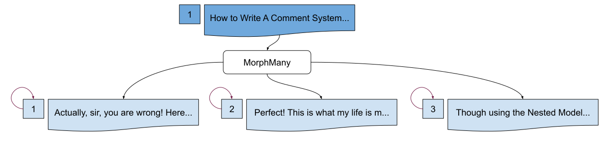
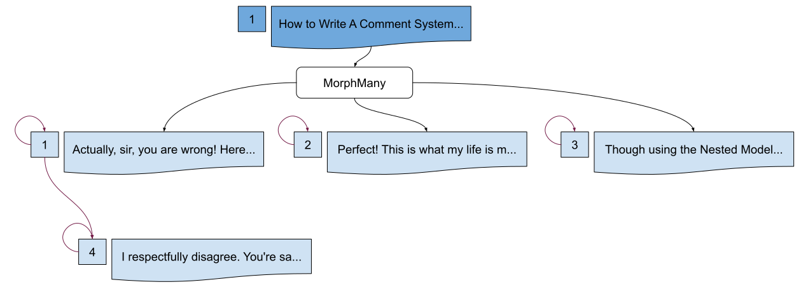

**Example**

## Commenting System via Closure Table

In this example, we will be implementing a commenting system for an imagined blog system utilizing the closure table model of storing data.

We will be using <a href="https://github.com/laravel/laravel">Laravel</a> for this example.

We will be supposing you already have a `blog` or a similar system set up and ready to integrate a comment system.

---

### Getting Started
Before we proceed, please note that this is for demonstration purposes only. This approach may not be the best one when doing a comment system. It would do just as well with a different hierarchy model -- like the Nested Model approach (arguably, a much better approach for Comment Systems).

This document will only show you how to do a comment system with the Closure Table Model approach.

#### **Migrations**

We need to generate two migration files: the `comments` table where we store all comments; and
the `commentstree` table where we store the relationship of comments with each other.

```bash
php artisan make:migration comments
```

For the `comments` table, the simpliest required column fields may look something like the following:
```php
// for comments
Schema::create('comments', function (Blueprint $table) {
    $table->bigIncrements('id');
    $table->longText('body');
    $table->unsignedBigInteger('user_id')->index();
    $table->morphs('commentable');
    $table->foreign('user_id')
          ->references('id')->on('users')
          ->onDelete('cascade')
          ->onUpdate('cascade');
    $table->timestamps();
    // You may, of course, add more. Like:
    // * soft delete timestamp
    // * upvotes/downvotes or liked/disliked
    // * a status field to toggle visibility
    // * etc.
});
```

Then, generate a `Comment` model:
```bash
php artisan make:model Comment
```

Then, run the command to generate a closure table:
```bash
php artisan make:closurable comments
```

This will create a migration with the table name `commentstree`. Though there is no need to edit the migration file generated, you may do so if desired.

#### **Using the Trait or Abstract Class**

Next, we will be using the trait `\Codrasil\Closurable\Closurable` on the `App\Comments` model.
```php
use Codrasil\Closurable\Closurable;

class Comments extends Model
{
    use Closurable;
}
```

**Alternatively** you may use the `\Codrasil\Closurable\Model`:
```php
use Codrasil\Closurable\Model as Closurable;

class Comments extends Closurable
{

}
```

If you passed in a different table name for the closure table, you may override the value using the `$closureTable` property:
```php
class Comments extends Model
{
    use Closurable;

    /**
     * The closure table associated with the model.
     *
     * @var string
     */
    protected $closureTable = 'some_other_table_tree';
}
```

---

### Operations

In addition with the instructions above, this section will assume you also have set up the controllers, routes, views, factories, and any miscellaneous files relating to a comment system.

More importantly, for this demonstration, you must have a `CommentFactory` already generated to make it easy for you to follow the document.

#### A Sample Environment

Assume two root comments are attached to an `App\Blog $blog` Model object with an ID of `1` from the `blogs` table.

```mysql
> SELECT id, title, slug, user_id FROM blogs;

    +----+---------------------------------------+-----------------+---------+
    | id | title                                 | slug            | user_id |
    +----+---------------------------------------+-----------------+---------+
    |  1 | How to Write A Comment System usin... | how-to-write... |       1 |
    +--------------------------------------------+---------------------------+
```

```mysql
> SELECT id, body, user_id, commentable_id, commentable_type FROM comments;

    +----+---------------------------------------+---------+----------------+------------------+
    | id | body                                  | user_id | commentable_id | commentable_type |
    +----+---------------------------------------+---------+----------------+------------------+
    |  1 | Actually, sir, you are wrong! Here... |       2 |              1 | App\Blog         |
    |  2 | Perfect! This is what my life is m... |       3 |              1 | App\Blog         |
    +--------------------------------------------+---------+----------------+------------------+
```

```mysql
> SELECT ancestor_id, descendant_id, depth, root FROM commentstree;

    +-------------+---------------+-------+------+
    | ancestor_id | descendant_id | depth | root |
    +-------------+---------------+-------+------+
    |           1 |             1 |     0 |    1 |
    |           2 |             2 |     0 |    1 |
    +-------------+---------------+-------+------+
```

**Please note** that your `App\Blog` must have a `MorphMany` relationship with `App\Comments`.

---

#### Saving Root Comments
To save a new root comment for the `App\Blog id 1`:

* we should save the comment like you would normally do
* we should attach the comment to self

```php
// One way to save a new comment.
$blog = Blog::find(1);
$comment = $blog->comments()->create([
    'body' => 'Though using the Nested Model is p...',
    'user_id' => 4,
]);

// CLOSURE SAVE
$comment->attachToSelf(); // This is shorthand for $comment->closurables()->attachToSelf();
```

On the `comments` table:
```mysql
> SELECT id, body, user_id, commentable_id, commentable_type FROM comments;

    +----+---------------------------------------+---------+----------------+------------------+
    | id | body                                  | user_id | commentable_id | commentable_type |
    +----+---------------------------------------+---------+----------------+------------------+
    |  1 | Actually, sir, you are wrong! Here... |       2 |              1 | App\Blog         |
    |  2 | Perfect! This is what my life is m... |       3 |              1 | App\Blog         |
--> |  3 | Though using the Nested Model is p... |       4 |              1 | App\Blog         |
    +--------------------------------------------+---------+----------------+------------------+
```

And on the `commentstree` table:
```mysql
> SELECT ancestor_id, descendant_id, depth, root FROM commentstree;

    +-------------+---------------+-------+------+
    | ancestor_id | descendant_id | depth | root |
    +-------------+---------------+-------+------+
    |           1 |             1 |     0 |    1 |
    |           2 |             2 |     0 |    1 |
--> |           3 |             3 |     0 |    1 |
    +-------------+---------------+-------+------+
```

Visual representation:

<p align="center"></p>

---

#### Saving Replies

Assume `App\User id 3` will reply to the `App\Comment id 1`.

The code below will:

* attach the new comment made by `App\User id 3` to the Blog.
* look for the parent Comment, which is `App\Comment id 1`.
* save the closure relationship.

```php
$blog = Blog::findOrFail(1);
$comment = $blog->comments()->create([
    'body' => "I respectfully disagree. You're sa...",
    'user_id' => 3,
]);

...

$parent = Comment::findOrFail(1);
$parent->closurables()->attach($comment);
```

on the `comments` table:
```mysql
> SELECT id, body, user_id, commentable_id, commentable_type FROM comments;

    +----+---------------------------------------+---------+----------------+------------------+
    | id | body                                  | user_id | commentable_id | commentable_type |
    +----+---------------------------------------+---------+----------------+------------------+
    |  1 | Actually, sir, you are wrong! Here... |       2 |              1 | App\Blog         |
    |  2 | Perfect! This is what my life is m... |       3 |              1 | App\Blog         |
    |  3 | Though using the Nested Model is p... |       4 |              1 | App\Blog         |
--> |  4 | I respectfully disagree. You're sa... |       3 |              1 | App\Blog         |
    +--------------------------------------------+---------+----------------+------------------+
```

And on the `commentstree` table:
```mysql
> SELECT ancestor_id, descendant_id, depth, root FROM commentstree ORDER BY descendant_id;

    +-------------+----------------+-------+------+
    | ancestor_id | ^descendant_id | depth | root |
    +-------------+----------------+-------+------+
    |           1 |              1 |     0 |    1 |
    |           2 |              2 |     0 |    1 |
    |           3 |              3 |     0 |    1 |
--> |           1 |              4 |     1 |    0 |
--> |           4 |              4 |     0 |    0 |
    +-------------+----------------+-------+------+
```

Visual representation:

<p align="center"></p>

---

#### Deleting Entire Comment Thread

It is relatively easy to delete an entire thread of comments.

Continuing with what we have in the example above, this time we would what to delete the `App\Comment id 1`. Doing so will also delete `App\Comment id 4` and any other descendants.

```php
$comment = Comment::find(1);
$comment->closurables()->detach();
```

**Note** The `comments` table entries will still be intact.

On the `commentstree` table:
```mysql
> SELECT ancestor_id, descendant_id, depth, root FROM commentstree ORDER BY descendant_id;

    +-------------+----------------+-------+------+
    | ancestor_id | ^descendant_id | depth | root |
    +-------------+----------------+-------+------+
    |           2 |              2 |     0 |    1 |
    |           3 |              3 |     0 |    1 |
    +-------------+----------------+-------+------+
```

#### What Happens When A Comment is Deleted Directly

Be aware that running the following code may produce side effects, as explained below.
```php
$comment = Comment::find(1);
$comment->delete();
```

If for some reason a comment in `comments` table is deleted without the closure table being updated, then it will break. Just kidding, it will return all remaining comments. The `commentstree` will be updated accordingly. This is all thanks to the nature of our schema for the table:
```php
...
$table->foreign('ancestor_id')
  ->references('id')->on('comments')
  ->onDelete('cascade') // <--- This line is responsible for the auto delete
  ->onUpdate('cascade'); // <--- This line is responsible for the auto update
$table->foreign('descendant_id')
  ->references('id')->on('comments')
  ->onDelete('cascade') // <--- This line is responsible for the auto delete
  ->onUpdate('cascade'); // <--- This line is responsible for the auto update
...
```

**But...**

All descendants of the deleted comment will still exist but not retrieved.

That is, it will not delete the deleted comment's descendants. Thus, making `orphans`.
```php
$comment = Comment::find(1);
$comment->delete();
```
```mysql
> SELECT ancestor_id, descendant_id, depth, root FROM commentstree ORDER BY descendant_id;

    +-------------+----------------+-------+------+
    | ancestor_id | ^descendant_id | depth | root |
    +-------------+----------------+-------+------+
    |           2 |              2 |     0 |    1 |
    |           3 |              3 |     0 |    1 |
    |           4 |              4 |     0 |    0 | <-- orphan; no parent; not a root comment; alone; forgotten
    +-------------+----------------+-------+------+
```

Avoid making `orphans`. In code, and in life.

---

#### Conclusion

In this document, we have integrated a commenting system to our blog implementing the closure table model. We need to generate at least two migration files. We need to use a trait to the model being closure nested. We have stored a root comment; saved replies; deleted an entire thread of comments; and avoided making orphans.

For further development, read more about the Nested Model approach, and how it is different from the Closure Table.
