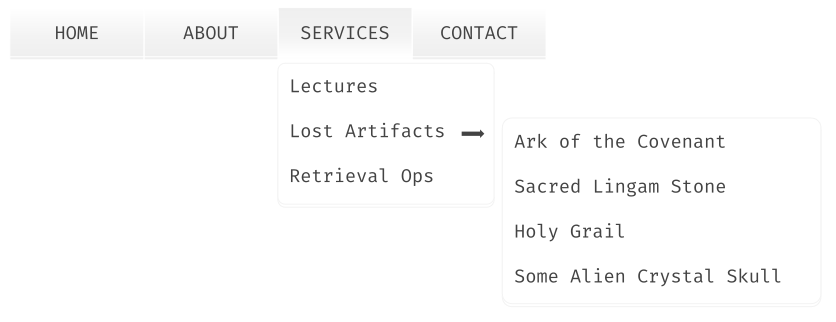

**Example**

## Navigation Menus

In this example, we will be implementing a navigation menu system for an imagined website utilizing the closure table model of storing data.

We will be using <a href="https://github.com/laravel/laravel">Laravel</a> for this example.

---

### Getting Started

Navigation menus are one of the most common components used in dynamic web development. The `Closurable` library is best suited for these kinds of nested hierarchic data.

#### **Migrations**
We need to generate two migration files: the `menus` table where we store all menu specific data like `text`, `url`, `sort` order, and such; and
the `menumap` table where we store the relationship of menus with each other.

```bash
php artisan make:migration create_menus_table
```
```php
Schema::create('menus', function (Blueprint $table) {
    $table->bigIncrements('id');
    $table->string('text');
    $table->longText('uri')->nullable();
    $table->bigInteger('sort')->index()->default(0);
});
```

Then, run the command to generate a closure table:
```bash
php artisan make:closurable menus --create menumap
```

**Note** we need to pass in an option `--create <name>`, because by default it will generate a table named `menustree` instead.

#### **Model**
Generate a `Menu` model:
```bash
php artisan make:model Menu
```

#### **Using Closurable**

Next, we will be using the trait `\Codrasil\Closurable\Closurable` on the `App\Menu` model, and also override the `$closureTable` property value.
```php
use Codrasil\Closurable\Closurable;

class Menu extends Model
{
    use Closurable;

    /**
     * The closure table associated with the model.
     *
     * @var string
     */
    protected $closureTable = 'menumap';
}
```

---

### Operations

In addition with the instructions above, this section will assume you also have set up the controllers, routes, views, factories, and any miscellaneous files relating to `menus`.

More importantly, for this demonstration, you must have a `MenuFactory` already generated to make it easy for you to follow the document.

#### A Sample Navigation Menu
We will be working with the following data represented as a nested navigation menu:

```
- Home
- About
- Services
  -- Lectures
  -- Lost Artifacts
     --- Ark of the Covenant
     --- Sacred Lingam Stone
     --- Holy Grail
     --- Some Alien Crystal Skull
  -- Retrieval Ops
- Contact
```

#### Saving Root Menus
To save the root menus:

```php
with(Menu::create(['text' => 'Home', 'uri' => '/', 'sort' => 0]))->attachToSelf();

...

with(Menu::create(['text' => 'About', 'uri' => '/about-indy', 'sort' => 1]))->attachToSelf();

...

with(Menu::create(['text' => 'Services', 'uri' => '/services', 'sort' => 2]))->attachToSelf();

...

with(Menu::create(['text' => 'Contact', 'uri' => '/help-me-doctor-jones-you-re-my-only-hope', 'sort' => 3]))->attachToSelf();
```

Inspecting the database:
```mysql
> SELECT * FROM menus ORDER BY sort;

    +----+----------+-------------------------------------------+-------+
    | id | text     | uri                                       | ^sort |
    +----+----------+-------------------------------------------+-------+
    |  1 | Home     | /                                         |     0 |
    |  2 | About    | /about-indy                               |     1 |
    |  3 | Services | /services                                 |     2 |
    |  4 | Contact  | /help-me-doctor-jones-you-re-my-only-hope |     3 |
    +----+----------+-------------------------------------------+-------+
```

```mysql
> SELECT * FROM menumap ORDER BY descendant_id;

    +-------------+----------------+-------+------+
    | ancestor_id | ^descendant_id | depth | root |
    +-------------+----------------+-------+------+
    |           1 |              1 |     0 |    1 |
    |           2 |              2 |     0 |    1 |
    |           3 |              3 |     0 |    1 |
    |           4 |              4 |     0 |    1 |
    +-------------+----------------+-------+------+
```

---

#### Attaching Child Menus
Let us attach the submenus for the `Services` menu entry.

```php
$services = Menu::find(3); // Services

// Omitted some fields for brevity
$services->closurables()->attach(Menu::create(['text' => 'Lectures', ...]));
$services->closurables()->attach(Menu::create(['text' => 'Lost Artifacts', ...]));
$services->closurables()->attach(Menu::create(['text' => 'Retrieval Ops', ...]));
```

Inspecting the database:
```mysql
> SELECT * FROM menus;

    +----+----------------+-------------------------------------------+------+
    | id | text           | uri                                       | sort |
    +----+----------------+-------------------------------------------+------+
    |  1 | Home           | /                                         |    0 |
    |  2 | About          | /about-indy                               |    1 |
    |  3 | Services       | /services                                 |    2 |
    |  4 | Contact        | /help-me-doctor-jones-you-re-my-only-hope |    3 |
--> |  5 | Lectures       | /services/lectures                        |    0 |
--> |  6 | Lost Artifacts | /services/artifacts                       |    1 |
--> |  7 | Retrieval Ops  | /services/retrieval                       |    2 |
    +----+----------------+-------------------------------------------+------+
```

```mysql
> SELECT * FROM menumap ORDER BY descendant_id;

    +-------------+----------------+-------+------+
    | ancestor_id | ^descendant_id | depth | root |
    +-------------+----------------+-------+------+
    |           1 |              1 |     0 |    1 |
    |           2 |              2 |     0 |    1 |
    |           3 |              3 |     0 |    1 |
    |           4 |              4 |     0 |    1 |
--> |           3 |              5 |     1 |    1 |
--> |           5 |              5 |     0 |    0 |
--> |           3 |              6 |     1 |    0 |
--> |           6 |              6 |     0 |    0 |
--> |           3 |              7 |     1 |    0 |
--> |           7 |              7 |     0 |    0 |
    +-------------+----------------+-------+------+
```

**Attaching More Children**

Finishing the menus, let us now attach the remaining submenus for the `Lost Artifacts` menu entry.
```php
$menu = Menu::find(6); // Lost Artifacts
$menu->closurables()->attach(Menu::create(['text' => 'Ark of the Covenant', ...]));
$menu->closurables()->attach(Menu::create(['text' => 'Sacred Lingam Stone', ...]));
$menu->closurables()->attach(Menu::create(['text' => 'Holy Grail', ...]));
$menu->closurables()->attach(Menu::create(['text' => 'Some Alien Crystal Skull', ...]));
```

**Visual Representation**:
<p align="center"></p>
